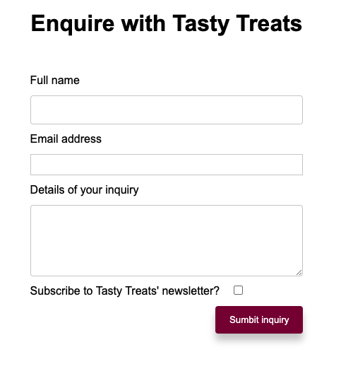

# Tasty Treats Local Bakery Inquiry Form
_____
An inquiry form created for local business owner, Terence, to capture the following information from his curious customers:
- Name
- Email address
- Message 
- Subscribe to newsletter (y/n)

This is served using pure NodeJS without the use of any frameworks or libraries. Once submitted, the information gets saved to the file `userData.txt`. If the user has opted in to receiving the newsletter the words "subscribe=on" will appear next to their inquiry, otherwise it will be left blank.

## Getting started
* `git clone` this repo
* Ensure you have NodeJS installed, if not, install it from [their site](https://nodejs.org/en/)
* You can check if you have NodeJS installed by running `node -v`
* Run the command `node app.js` 
* Click/copy the link in the terminal http://127.0.0.1:3000 to visit the form

## My approach and learning 
* This was my first attempt using NodeJS to serve a form submission
* I wanted to create this using NodeJS only with no frameworks to demonstrate a clearer understanding of NodeJS, it being my first attempt
